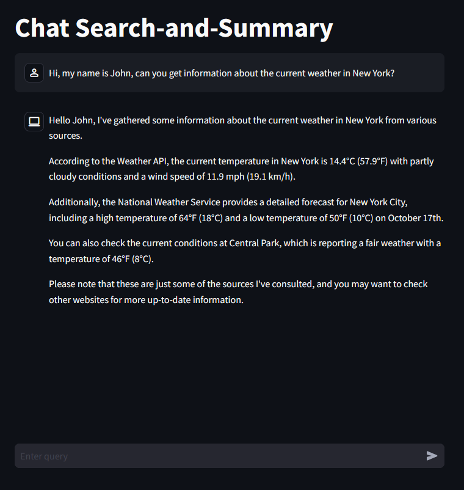

<h1> <p style="text-align:center;"> Chat Search-and-Summary <p> </h1>


## Overview
Chat-GPT clone using LangGraph to implement a Retrieval Augmented Generation (RAG) agent, equipped with web search and document summary tools, wrapped in a Streamlit GUI.

Tools available to RAG Agent:
- Web search
- Chat history
- PDF document summary (coming)

## Requirements
Language: Python 3.10
Models: llama3.2:3b-instruct-fp16, llama3.1

## Setup
```
py -m venv \path\to\venv

\path\to\venv\Scripts\activate.bat

pip install -r requirements.txt
```

## Run
```\path\to\project> streamlit run main.py```

